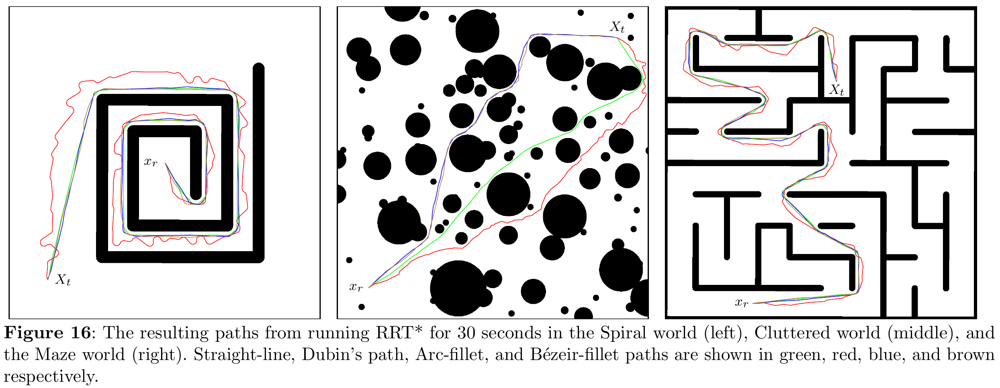
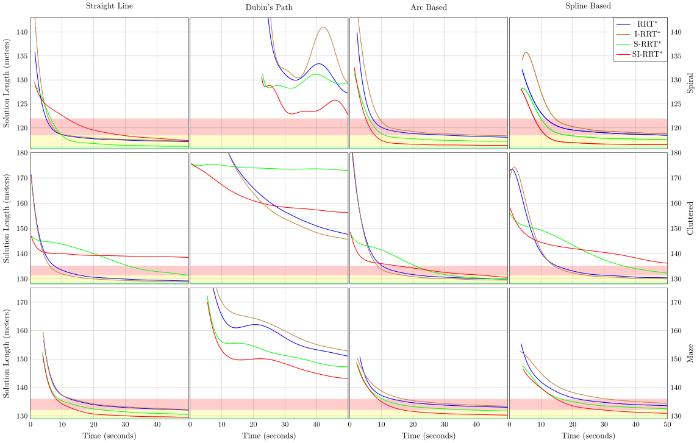
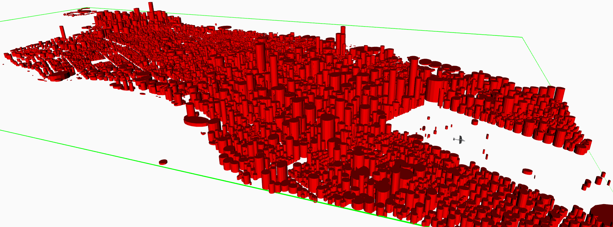
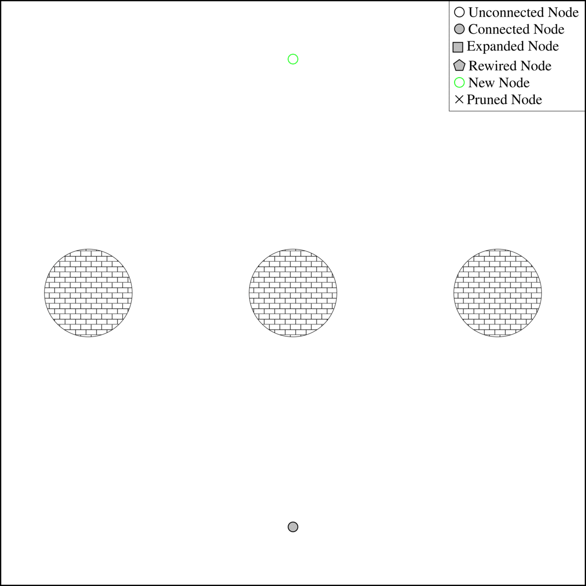

# Advanced Path Planning


This repository implements several path planning algorithms with a generic C++ interface.
Many of the algorithms have been implemented with both the original edge generation methodology and a fillet-based formulation which makes considering kinematic constraints like max curvature much faster, see the Figures below [[11](#11), [12](#12)].
Additionally, the package includes various edge generators that can be used with each planner that simulate given vehicle models.
For example, the Dubin's car and airplane.




This repository contains many simulated environments for testing and comparing the algorithms implemented.
For example, see the simulation of the actual buildings in Manhattan below.



The table below lists each of the algorithms this repository implements, the variations each algorithm supports, and the names of the papers that proposed them.

| Algorithm                       | K Nearest Searches | Fillet-Based | Source      |
|---------------------------------|--------------------|--------------|-------------|
| RRT                             | Yes                | Yes          | [[1](#1)]   |
| Bidirectional RRT               | No                 | No           | [[2](#2)]   |
| RRT Connect                     | No                 | No           | [[3](#3)]   |
| RRT\*                           | Yes                | Yes          | [[4](#4)]   |
| Intelligent Bidirectional RRT\* | No                 | No           | [[5](#5)]   |
| RRT\* Smart                     | Yes                | Yes          | [[6](#6)]   |
| Smart and Informed RRT\*        | Yes                | Yes          | Novel       |
| BIT\*                           | No                 | Yes          | [[10](#10)] |
| Source of the variants          | [[7](#7)]          | Novel        |             |

<figure>
  <figcaption>A step by step demonstration of the BIT* algorithm.</figcaption>
  
</figure>

## Dependencies

This repository is intended for use in a [ROS 2](https://docs.ros.org/en/jazzy/index.html) Colcon workspace.
Other than Ament, which can be installed with the rest of the ROS 2 distribution you're using [here](https://docs.ros.org/en/jazzy/Installation.html), the following command will install all system dependencies on an Ubuntu system.

```bash
sudo apt install libeigen3-dev libomp-dev libjemalloc2 libjemalloc-dev libopencv-dev libblas-dev liblapack-dev libtbb-dev libflann-dev ros-jazzy-ompl libboost-all-dev
```
Additionally, this package is dependent on two other repositories found here: https://github.com/james-swedeen/matplotlibcpp and https://github.com/james-swedeen/kalman_filter.

## Sub Packages

### rrt_search
This is where most of the path planning functionality is implemented and where the C++ API for the path planning may be found.
This includes various path planning algorithms as well as various edge generators that can be used with them.

### ompl_benchmark
This package uses the [Open Motion Planning Library (OMPL)](https://ompl.kavrakilab.org/) to benchmark the algorithms developed in the rrt_search package.

### occupancy_grid
This package implements a basic occupancy grid data structure using OpenCV.

### visibility_graph
This package implements the well know visibility graph path planner and is used in the rrt_search package.

### radar_detection
This package provides the implementation of heuristics for the probability of detection by signal pulse radar station.
It is used by path planners when avoiding detection is mission critical.

### uav_interfaces
This package defines a few ROS 2 message and service types.

## References

<a id="1">[1]</a>
S. LaValle (1998) Rapidly-exploring random trees: A new tool for path planning

<a id="2">[2]</a>
M. Jordan, A. Perex (2013) Optimal bidirectional rapidly-exploring random trees

<a id="3">[3]</a>
J. Kuffner, S. LaValle (2000) RRT-Connect: An Efficient Approach to Single-Query Path Planning

<a id="4">[4]</a>
S. Karaman, E. Frazzoli (2011) Sampling-based algorithms for optimal motion planning

<a id="5">[5]</a>
A. Qureshi, Y. Ayaz (2015) Intelligent bidirectional rapidly-exploring random trees for optimal motion planning in complex cluttered environments

<a id="6">[6]</a>
J. Nasir, F. Islam, U. Malik, Y. Ayaz, O. Hasan, M. Khan, M. Muhammad (2013) RRT\*-SMART: A Rapid Convergence Implementation of RRT\*

<a id="7">[7]</a>
S. LaValle (2006) Planning Algorithms

<a id="8">[8]</a>
C. Moon, W. Chung (2015) Kinodynamic Planning Dual-Tree RRT (DT-RRT) for Two-Wheeled Mobil robots Using the Rapidly Exploring Random Tree

<a id="9">[9]</a>
Moll M, Sucan IA and Kavraki LE (2015) Benchmarking motion planning algorithms: An extensible infrastructure for analysis and visualization. IEEE Robotics Automation Magazine 22(3): 96–102.

<a id="10">[10]</a>
Gammell JD, Barfoot TD, Srinivasa SS. Batch Informed Trees (BIT*): Informed asymptotically optimal anytime search. The International Journal of Robotics Research. 2020;39(5):543-567. doi:10.1177/0278364919890396

<a id="11">[11]</a>
Swedeen, J., Droge, G. & Christensen, R. Fillet-based: A Rapid Convergence Implementation of RRT* for Curvature Constrained Vehicles. J Intell Robot Syst 108, 68 (2023). https://doi.org/10.1007/s10846-023-01846-x

<a id="12">[12]</a>
J. Swedeen and G. Droge, "Fillet-Based Batch Informed Trees (FB-BIT*): Rapid Convergence Path Planning for Curvature Constrained Vehicles," 2023 Seventh IEEE International Conference on Robotic Computing (IRC), Laguna Hills, CA, USA, 2023, pp. 71-78, doi: 10.1109/IRC59093.2023.00019.


