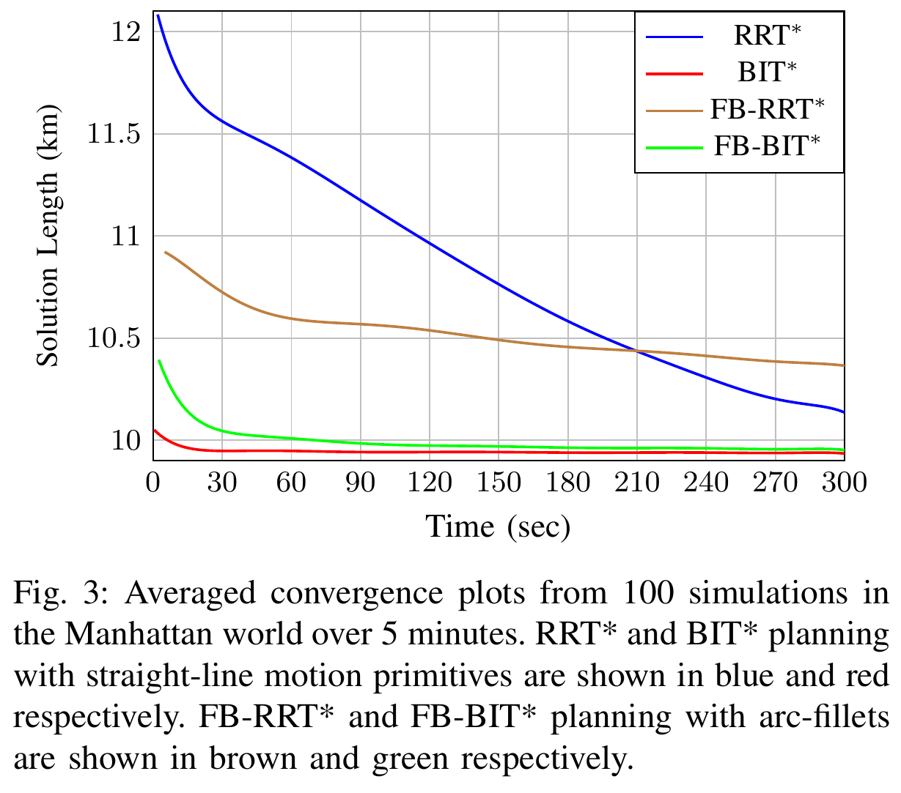
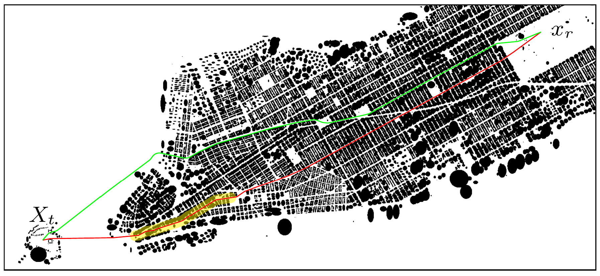

# RRT Search

This package implements several path planning algorithms with a generic C++ interface.
Many of the algorithms have been implemented with both the original edge generation methodology and a fillet-based formulation which makes considering kinematic constraints like make curvature much faster, see the Figure below [[11](#11), [12](#12)].




Additionally, package includes various edge generators that can be used with each planner that simulate given vehicle models.
For example, the Dubin's car and airplane.

The table below lists each of the algorithms that this package implements, the variations each algorithm supports, and the names of the papers that purposed them.

| Algorithm                       | K Nearest Searches | Fillet-Based | Source      |
|---------------------------------|--------------------|--------------|-------------|
| RRT                             | Yes                | Yes          | [[1](#1)]   |
| Bidirectional RRT               | No                 | No           | [[2](#2)]   |
| RRT Connect                     | No                 | No           | [[3](#3)]   |
| RRT\*                           | Yes                | Yes          | [[4](#4)]   |
| Intelligent Bidirectional RRT\* | No                 | No           | [[5](#5)]   |
| RRT\* Smart                     | Yes                | Yes          | [[6](#6)]   |
| Smart and Informed RRT\*        | Yes                | Yes          | Novel       |
| BIT\*                           | No                 | Yes          | [[10](#10)] |
| Source of the variants          | [[7](#7)]          | Novel        |             |

## Dependencies

This package is intended to be used in a [ROS 2](https://docs.ros.org/en/jazzy/index.html) Colcon workspace.
Other then Ament, which can be installed with the rest of the ROS 2 distribution you're using [here](https://docs.ros.org/en/jazzy/Installation.html), the following command will install all system dependencies on an Ubuntu system.

```bash
sudo apt install libeigen3-dev libomp-dev libboost-all-dev libblas-dev liblapack-dev libtbb-dev libjemalloc2 libjemalloc-dev libflann-dev
```
Additionally, this package is dependent on two other repositories found here: https://github.com/james-swedeen/matplotlibcpp and https://github.com/james-swedeen/kalman_filter.

## Demonstrations

### Path Planning Demonstrations

There are several launch files to demonstrate the path planning capabilities of this package with different path planning algorithms and constraints.
To tun these demonstrations run one of the following commands.
```bash
ros2 launch rrt_search path_planning_demo.launch.py
ros2 launch rrt_search dubins_path_planning_demo.launch.py
ros2 launch rrt_search fillet_path_planning_demo.launch.py
ros2 launch rrt_search reverse_fillet_path_planning_demo.launch.py
```
These will run the specified algorithms for the time that is specified in the launch files.
After planning, the resulting plan and the environment obstacles will be plotted in a Matplotlib window.

### Error Budget Demonstration

This package contains a node that can be used to generate error budges of the estimation errors a fixed wing UAV experiences while passing through GPS denied areas.
The node reads in waypoints for the UAV dynamics to follow and GPS denied area information from the [ol_error_budget_demo.launch.py](./launch/ol_error_budget_demo.launch.py) ROS launch file.
After simulating the UAV along the provided waypoints the node generates an error budget analysis and plots the results.

Once the code has been built and the workspace sourced, the error budget example can be ran with the following command.
```bash
ros2 launch rrt_search ol_error_budget_demo.launch.py
```
The program will not end until all of the generated plots are closed.

To change the trajectory the UAV takes or the location of the GPS denied areas the `ol_error_budget_demo.launch.py` launch file located in the rrt_search package can be modified.
The `waypoints_dict` variable controls the number of waypoints that the UAV follows and each waypoints location.
The `gps_denied_dict` variable controls the number and location of the GPS denied areas.


## Known Issues

1. Things that needs to be implemented or reimplemented
  * Bidirectional-RRT variants
  * Fillet-Based bidirectional variants

## References

<a id="1">[1]</a>
S. LaValle (1998) Rapidly-exploring random trees: A new tool for path planning

<a id="2">[2]</a>
M. Jordan, A. Perex (2013) Optimal bidirectional rapidly-exploring random trees

<a id="3">[3]</a>
J. Kuffner, S. LaValle (2000) RRT-Connect: An Efficient Approach to Single-Query Path Planning

<a id="4">[4]</a>
S. Karaman, E. Frazzoli (2011) Sampling-based algorithms for optimal motion planning

<a id="5">[5]</a>
A. Qureshi, Y. Ayaz (2015) Intelligent bidirectional rapidly-exploring random trees for optimal motion planning in complex cluttered environments

<a id="6">[6]</a>
J. Nasir, F. Islam, U. Malik, Y. Ayaz, O. Hasan, M. Khan, M. Muhammad (2013) RRT\*-SMART: A Rapid Convergence Implementation of RRT\*

<a id="7">[7]</a>
S. LaValle (2006) Planning Algorithms

<a id="8">[8]</a>
C. Moon, W. Chung (2015) Kinodynamic Planning Dual-Tree RRT (DT-RRT) for Two-Wheeled Mobil robots Using the Rapidly Exploring Random Tree

<a id="9">[9]</a>
Moll M, Sucan IA and Kavraki LE (2015) Benchmarking motion planning algorithms: An extensible infrastructure for analysis and visualization. IEEE Robotics Automation Magazine 22(3): 96–102.

<a id="10">[10]</a>
Gammell JD, Barfoot TD, Srinivasa SS. Batch Informed Trees (BIT*): Informed asymptotically optimal anytime search. The International Journal of Robotics Research. 2020;39(5):543-567. doi:10.1177/0278364919890396

<a id="11">[11]</a>
Swedeen, J., Droge, G. & Christensen, R. Fillet-based: A Rapid Convergence Implementation of RRT* for Curvature Constrained Vehicles. J Intell Robot Syst 108, 68 (2023). https://doi.org/10.1007/s10846-023-01846-x

<a id="12">[12]</a>
J. Swedeen and G. Droge, "Fillet-Based Batch Informed Trees (FB-BIT*): Rapid Convergence Path Planning for Curvature Constrained Vehicles," 2023 Seventh IEEE International Conference on Robotic Computing (IRC), Laguna Hills, CA, USA, 2023, pp. 71-78, doi: 10.1109/IRC59093.2023.00019.


